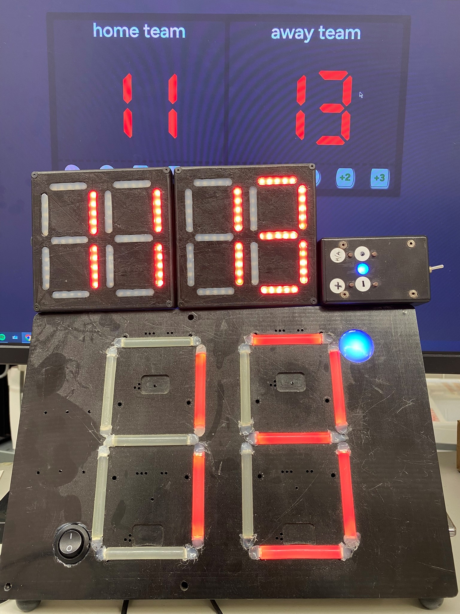
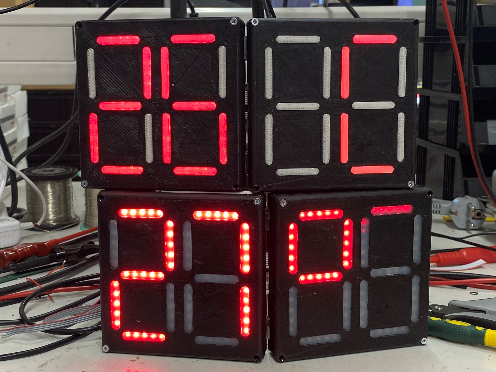

# Taskutabloo / Scoreboard

Taskutabloo ise on mitmekülgne ja funktsionaalne seade, mis on loodud spetsiaalselt sündmuste ja
mängude skoori, kellaaja ning temperatuuri kuvamiseks. Sellel on kaks kahekohalist
seitsmesegmendilist ekraani, mis võimaldavad selgelt ja nähtavalt kuvada mänguskoori
vahemikus 0 kuni 99 punkti. Lisaks näitab tabloo täpset kellaaega ning ümbritsevat
temperatuuri, andes kasutajale olulist teavet reaalajas. Tablool on laiendatav funktsionaalsus,
mis võimaldab lisada juurde uusi funktsioone vastavalt vajadustele ja kasutaja soovidele,
muutes selle mitmekülgseks ja kohaldatavaks lahenduseks erinevate keskkondade jaoks.
Kasutades nutikat mikrokontrollerit või arendusplatvormi, on võimalik täiendada tablood
erinevate funktsioonidega nagu dünaamilised animatsioonid, häiresignaalid või isegi nutikad
ühendusvõimalused, muutes selle veelgi mitmekülgsemaks ja kasulikumaks seadmeks
erinevate rakenduste jaoks.

The pocket scoreboard itself is a versatile and functional device designed specifically for displaying event and game scores, as well as the time and temperature. It features two dual-digit seven-segment displays, allowing clear and visible presentation of game scores ranging from 0 to 99 points. Additionally, the scoreboard shows the precise time and surrounding temperature, providing users with important real-time information. The scoreboard offers expandable functionality, enabling the addition of new features according to needs and user preferences, making it a versatile and adaptable solution for various environments. By utilizing a smart microcontroller or development platform, it's possible to enhance the scoreboard with various functions such as dynamic animations, alarm signals, or even smart connectivity options, further enhancing its versatility and utility for different applications.

**Double digit 7segment screenboard with stm8s003f3 microprocessor on 10x10cm pcb**

## Kood kirjutatud / Code written in

ST Visual Develop and programmed with ST-Link V2.

## Veebirakendus / Web application

- **[GitHub - gametime](https://github.com/avrokj/gametime)**
- **[Test - test.gametime.ee](https://test.gametime.ee/)**
- **[Webpage - gametime.ee](https://gametime.ee/)**

## Pildid / Pictures

_Uus ja vana tabloo / New and old scoreboard_

_Taskutabloo prototüübid / Pocket scoreboard prototypes_
